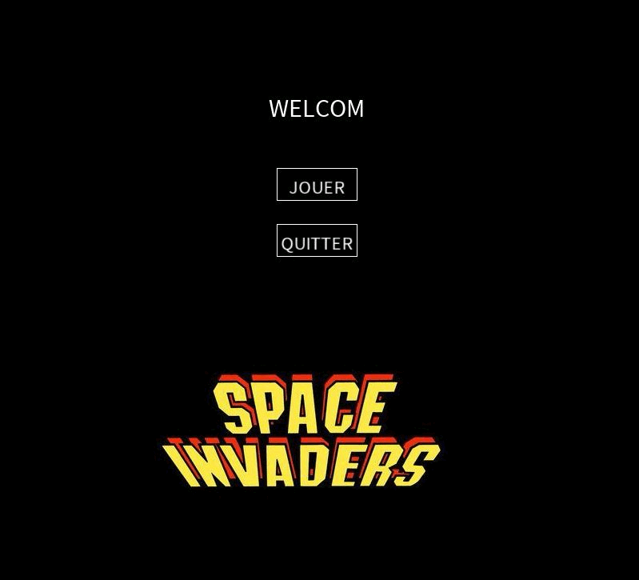

# 🛸 Space Invaders - Java Processing

Ce projet est une réinterprétation du célèbre jeu **Space Invaders**, développé en **Java avec la bibliothèque Processing**. Il a été réalisé dans le cadre d'un projet universitaire, avec pour objectif de concevoir un jeu fonctionnel respectant un cahier des charges précis.

---

## 🎮 Fonctionnalités principales

- Contrôle d’un vaisseau spatial (gauche/droite + tir)
- Déplacement automatique des envahisseurs et tirs ennemis
- Système de score et de vies
- Menu interactif (pause, sauvegarde, chargement, meilleurs scores, quitter)
- Sauvegarde/chargement de la partie et des scores
- Lecture des niveaux depuis des fichiers `.txt`

---

## 🧱 Architecture du projet

Le projet est organisé autour des fichiers suivants :

- `space_invaders.pde` : point d’entrée du jeu (setup, draw, keyPressed, etc.)
- `game.pde` : logique principale de gestion de partie
- `board.pde` : gestion du plateau de jeu
- `spaceship.pde` : classe du vaisseau joueur
- `menu.pde` : gestion du menu
- Dossiers :
  - `data/` : images, sons, scores, etc.
  - `levels/` : fichiers `.txt` contenant les niveaux

---

## 🖼️ Aperçu

---

## 🖥️ Installation locale

> 💡 Vous pouvez **télécharger le projet en ZIP** ou le **cloner via Git**.

### Étapes :

1. Installez [Processing](https://processing.org/download/)
2. Ouvrez `menu.pde` avec Processing
3. Lancez le programme en appuyant sur le bouton ▶️

---

## 🕹️ Contrôles

- `←` ou `Q` : aller à gauche
- `→` ou `D` : aller à droite
- `Espace` : tirer un missile
- `Échap` : afficher/masquer le menu pause

---

## 💾 scores
- Prise en compte du temps pour finir le niveau dans le calcul du score final.
- Les **meilleurs scores** sont enregistrés automatiquement si le joueur termine la partie avec un score élevé.

---

